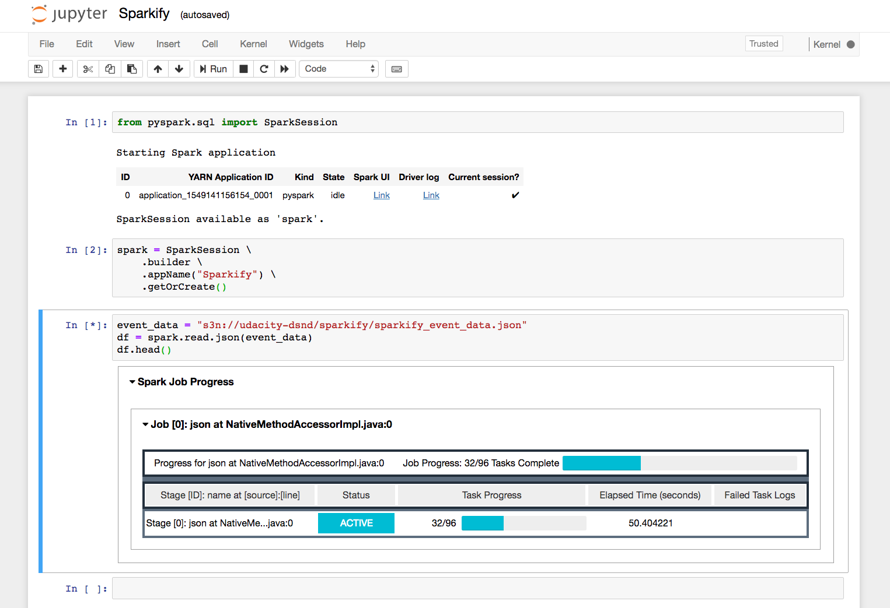

##User Churn Prediction with Spark(PySpark)

#### 1.Overview 

This is a Udacity Data Scientist Nanodegree Capstone Project to predict user churn of Sparkify which is a virtual music streaming service, created by Udacity to education purpose to mimic the datasets generated by companies such as Spotify.

We will use analytical skills to give insights on the datasets which include logs informations regarding the user's behaviors in Sparkify, and most importantly we want to retain the most user subscriptions as much as possible by predicting the churn rate.i.e. users who are at risk of downgrading from premium to free tier, or cancelling the service. Then sparkify company can take actions in advance such as : coupon, membership gift or other incentive plan to retain users.

We are provided two datasets ,a full size dataset of 12GB and a small size of 123MB, we will first use the small size dataset for the investigation in order to speed up , then process the final process on the full size dataset. Due to the size is much larger then laptop's RAM, we will use Apache Spark distributed cluster computing framework in this project. As AWS cloud comes with pre-configured environment solution for spark, we will deploy our model in AWS EMR platform.

### 2.Datasets
Full Sparkify Dataset: s3n://udacity-dsnd/sparkify/sparkify_event_data.json
You can also use the link below to access the mini 123MB dataset:

Mini Sparkify Dataset: s3n://udacity-dsnd/sparkify/mini_sparkify_event_data.json

### 3.Data pre-processing,Feature Engineering,Machine Learning and Evaluation

The project consists of three main steps that can be summarized as follows:

#####Load/Clean Dataset,Exploratory Data Analysis

loading the dataset
inferring the meaning of different variables, their type, the values they can take, their distribution understanding the relationships between different columns identifying missing values, potential duplicates Feature Engineering and Exploratory Data Analysis

transforming the original dataset (one row per user log) to a dataset with user-level (one row per user) information or statistics, obtained through mapping (e.g. user's gender, start/end of the observation period, etc.) or aggregation (e.g. song count, advertisement count, etc.)

##### Feature Engineering
Engineering the features that will be used to identify churned users, using aggregated statistic such as gender,level, thumbs up vs. thumbs down \etc.
Modelling and Evaluation

##### Machine Learning Pipeline and Evaluation

Defining pipelines that combine: standardization of the numerical features, feature assembly, and a selected binary classifier (logistic regression, random forest classifier or gradient boosting classifier)
splitting the dataset into train and test set pipeline training and tuning using grid-search with cross validation for all different classifiers on the training data ,analyzing model performance in cross validation (using AUC as metric) and extracting feature importances retraining the models that performed best on the full training set and evaluating model performance on the test set (using standard AUC and F1 metrics).f1score and AUC  metrics for  Logistic Regression, Random Forest Classifier and Gradient Boosting Classifier are experimented. Random Forest Classifier is chosen as it performed the best and it is not effected by imbalance in the data.

The above-listed steps describe the end-to-end model development process. This was done by running small datasets on local mode or simply rerunning the developed code on the full data-set, using an AWS EMR cluster.

### Installation

Notebook for this article was developed using Python v3.6.3, Pyspark v2.4, Pandas.

Starter Code
Below, you'll find starter code to create a spark session and read in the full 12 GB dataset for the DSND Capstone Project, Sparkify. :

		
		# Starter code
		from pyspark.sql import SparkSession

		# Create spark session
		spark = SparkSession \
    	.builder \
    	.appName("Sparkify") \
    	.getOrCreate()

		# Read in full sparkify dataset
		event_data = "s3n://udacity-dsnd/sparkify/sparkify_event_data.json"
		df = spark.read.json(event_data)
		df.head()

### Results

We have obtained an acceptable results based on score for metrics selected as below:

Logistic Regression:The F1 score on the test set is 79.83%
The areaUnderROC on the test set is 67.17%

Random Forest:The F1 score on the test set is 87.81%
The areaUnderROC on the test set is 95.08%

GBDT:The F1 score on the test set is 85.68%
The areaUnderROC on the test set is 88.83%

Then we chose Random Forest for further fine-tuning:

The F1 score of Random Forest classifier on the test set is 91.03%

The areaUnderROC of Random Forest classifier on the test set is 93.25%

### Conclusion

This capstone project is a great exercise allowing to put in practice several data science skills (data analysis, cleaning, feature extraction, machine learning pipeline creation, model evaluation and fine tuning…) to solve a problem close to those regularly encountered by customer-facing businesses.

Based on the good performance of trained ML models, we can conclude that we managed to build a binary classifier that can accurately identify churned users, based on the patterns activity and interaction with the music streaming service. 

This project allowed us to familiarize with Spark and how to leverage cloud computing platform.

We can continue to optimize data wrangling and feature engineering steps by using Spark’s best practices in order to speed up model training and testing (current solution is rather slow and might not scale well)

